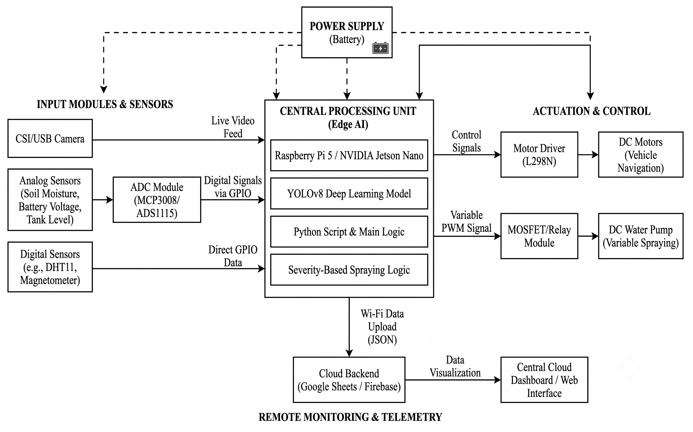
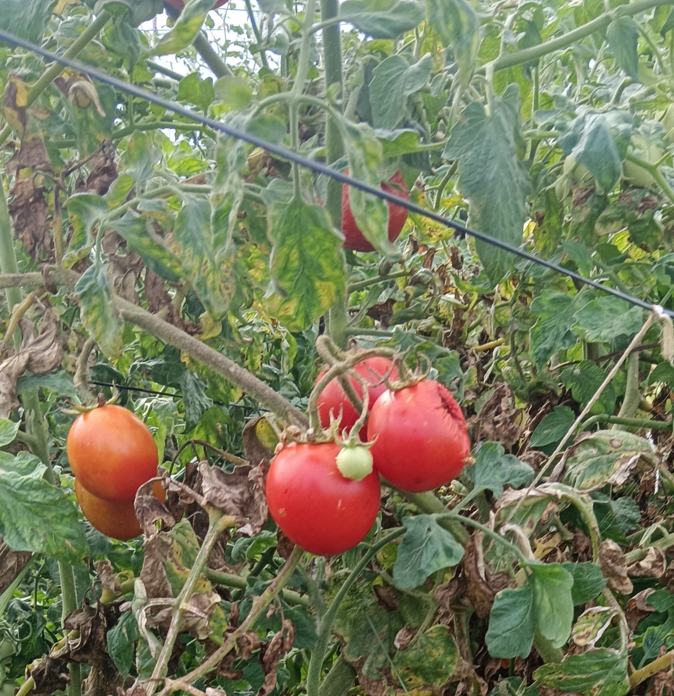
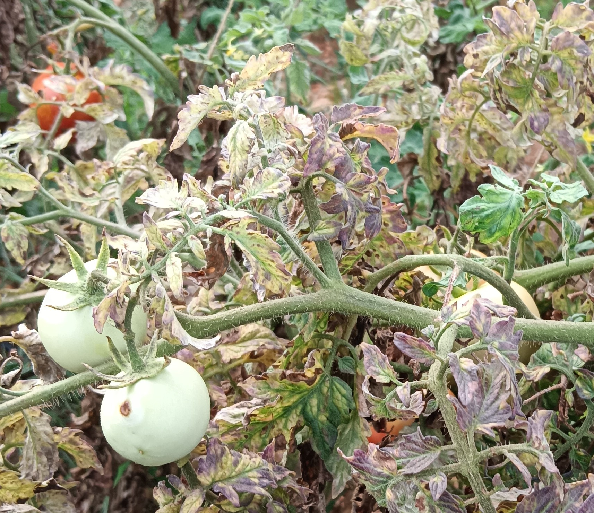
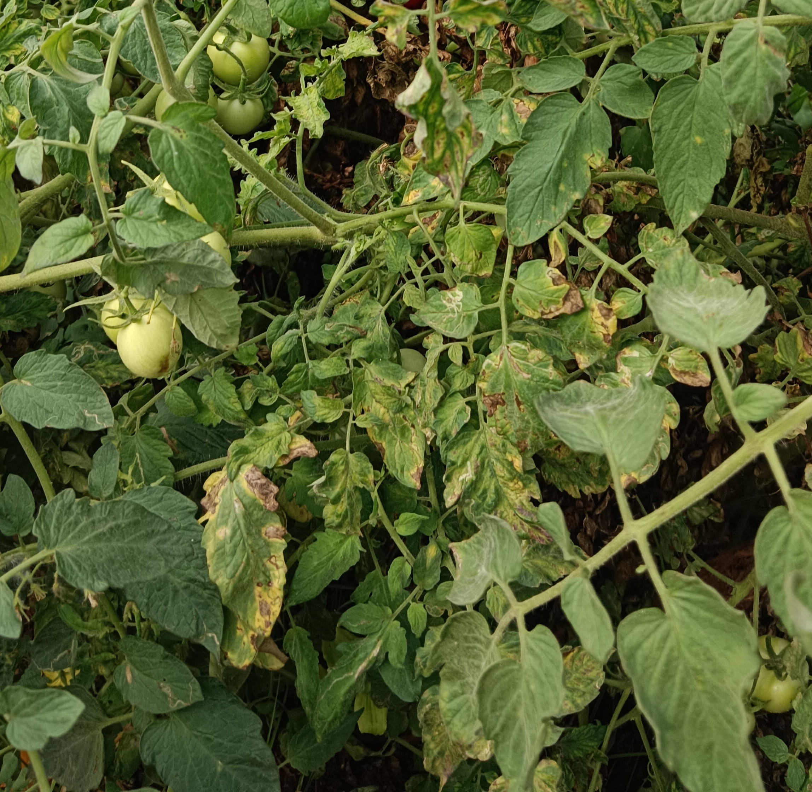
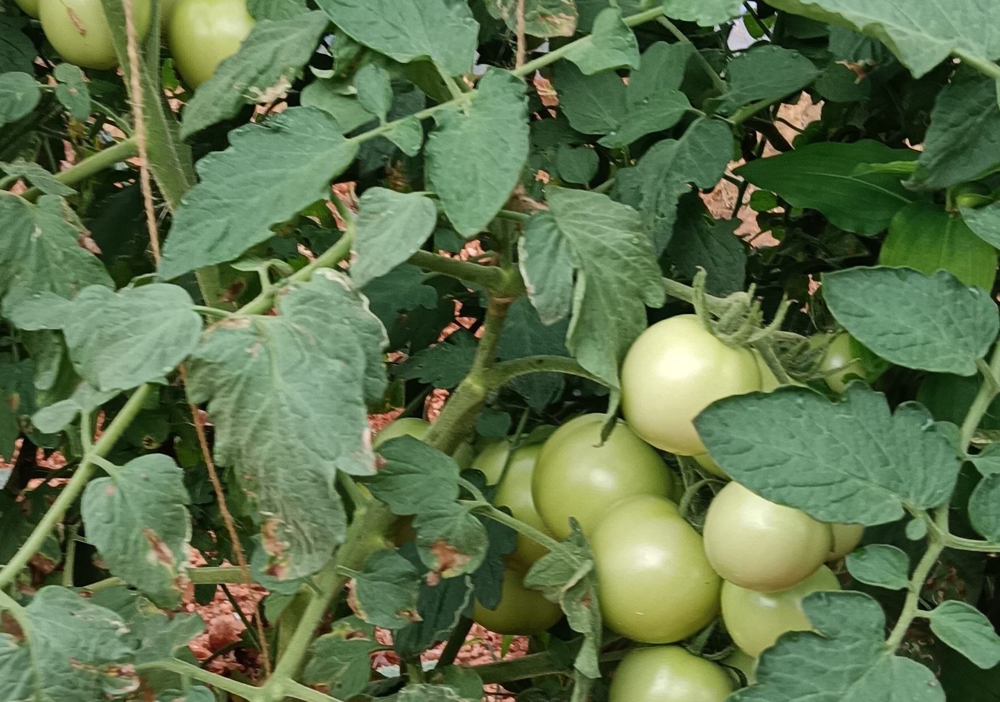
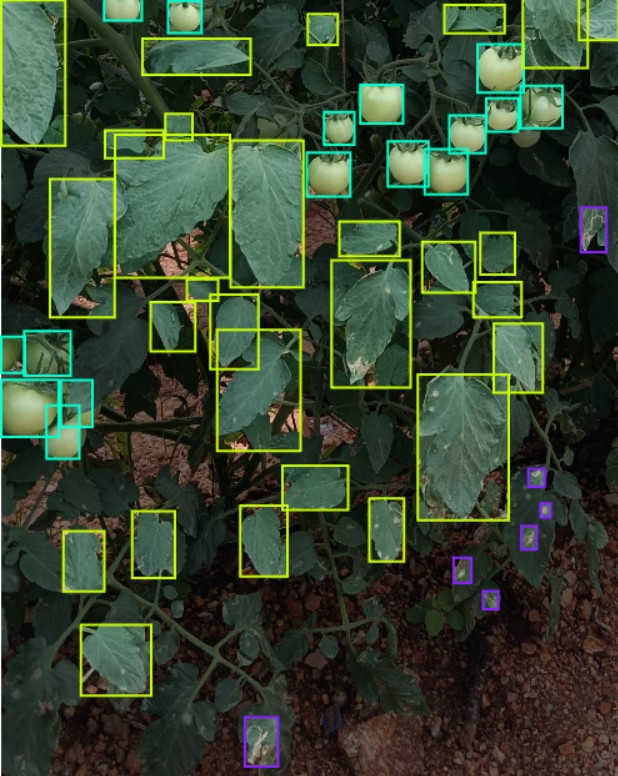
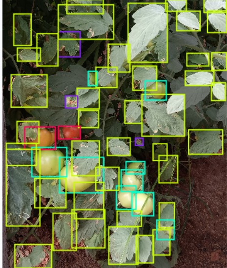
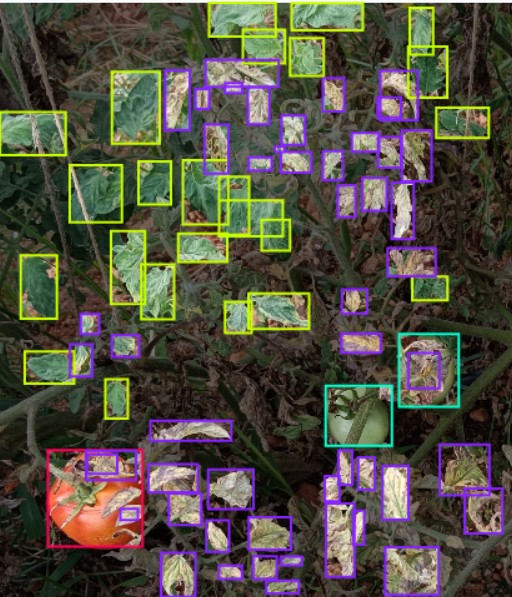
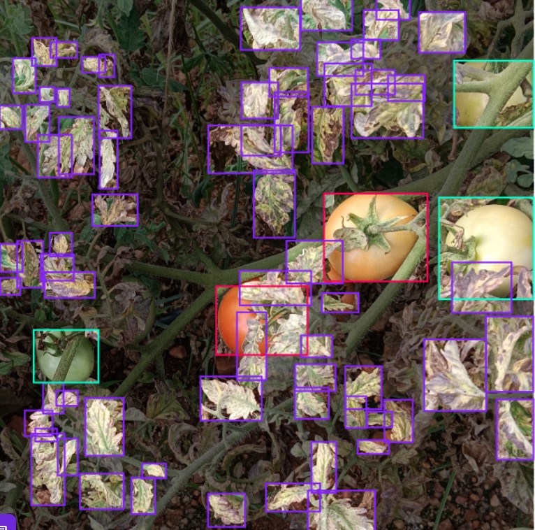
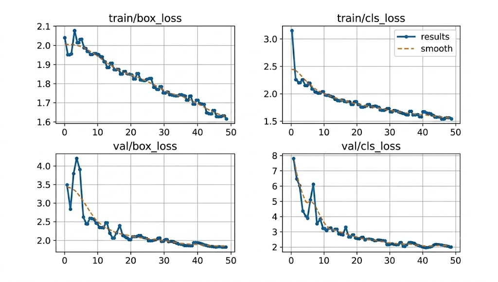

# 🌱 Edge-AI Powered Smart Rover
### Variable Rate Spraying and Crop Health Monitoring

*An autonomous, edge-AI ground rover that detects crop disease severity in real time and sprays only where it's needed — no cloud, no blanket spraying.*

---

## 📑 Table of Contents

- [Overview](#-overview)
- [Hardware](#-hardware)
- [Software / AI Pipeline](#-software--ai-pipeline)
- [System Block Diagram](#-system-block-diagram)
- [Dataset — Sample Images](#-dataset--sample-images)
- [Results (Phase-1)](#-results-phase-1)
- [Future Scope](#-future-scope)
- [Team](#-team)

---

## 🔍 Overview

Traditional "blanket spraying" wastes chemicals, degrades soil, and increases health risks for farmers. This project replaces that with a **ground-based 6WD rover** that:

- Runs a custom-trained **YOLOv8** object detection model natively on a **Raspberry Pi 4 Model B** — no cloud dependency, no latency.
- Detects healthy leaves, diseased leaves, and tomato ripeness (riped / unriped) in real time.
- Calculates infection **severity** from the size of the detected bounding box relative to the leaf.
- Dynamically adjusts a water pump's spray duration/pressure via **variable PWM** signals — heavier infection gets more spray, light infection gets less.
- Logs environmental telemetry (soil moisture, temperature/humidity via DHT11) and uploads it over Wi-Fi to **Google Sheets / Firebase** for a remote farmer dashboard.

---

## 🔧 Hardware

| Component | Role |
|---|---|
| **Raspberry Pi 4 Model B** | Central Edge-AI compute unit — runs YOLOv8 inference, spray logic, and telemetry |
| 6WD rover chassis + high-torque DC motors | Mobility over uneven farm terrain |
| L298N motor driver | Drive control for navigation |
| USB camera | Live video feed for YOLOv8 |
| DC water pump + Relay module | Variable-rate spraying |
| Soil moisture sensor | Analog telemetry (Pi 4B has no analog input pins) |
| DHT11 | Temperature & humidity, read directly via GPIO |
| Battery | Field-rated power supply |

> **Note:** Since the Raspberry Pi 4 Model B has less onboard compute than a Pi 5, the YOLOv8 model is typically exported to a lighter format (e.g. `.tflite` or ONNX with reduced input resolution) to maintain acceptable real-time frame rates during field inference.

---

## 🧠 Software / AI Pipeline

| Step | Stage | Description |
|:---:|---|---|
| 1 | **Capture** | Live frames from the onboard camera |
| 2 | **Detect** | Custom-trained YOLOv8 model classifies `healthy`, `unhealthy`, `riped_tomato`, `unriped_tomato` |
| 3 | **Severity Logic** | Infection bounding-box area ÷ leaf area → severity score |
| 4 | **Actuate** | Severity score → PWM duty cycle → pump driver (e.g. 30% duty for mild infection, 100% for severe) |
| 5 | **Telemetry** | Sensor + spray-event data packaged as JSON, pushed to cloud backend over Wi-Fi |

---

## 🗺️ System Block Diagram

---

## 🍃 Dataset — Sample Images

A subset of the custom tomato-leaf dataset is shown below: raw field captures alongside their annotated (bounding-box labelled) counterparts used to train the YOLOv8 model.

### Unannotated (Raw) Samples

| Sample 1 | Sample 2 | Sample 3 | Sample 4 |
|:---:|:---:|:---:|:---:|
|  |  |  |  |

### Annotated Samples

| Sample 1 | Sample 2 | Sample 3 | Sample 4 |
|:---:|:---:|:---:|:---:|
|  |  |  |  |

---

## 📊 Results (Phase-1)

- Trained over **50 epochs**; box loss and classification loss converge smoothly with no overfitting.
- Real-time inference on the Raspberry Pi 4B with confidence scores ranging **~37–82%** depending on occlusion/lighting.

**Normalized Confusion Matrix**

| Class | Accuracy |
|---|:---:|
| Healthy | 88% |
| Unhealthy | 89% |
| Riped Tomato | 91% |
| Unriped Tomato | 87% |
| Background (true-negative rate) | 95% |

### Training & Validation Loss Curves

*Box loss and classification loss for both training and validation sets over 50 epochs, showing steady convergence with no signs of overfitting.*

---

## 🚀 Future Scope

- Solar charging for extended field autonomy
- Broader disease/pest classes across multiple crop types
- Swarm robotics for large-scale field coverage
- Multi-axis nozzle arm to reach leaf undersides

---

## 👥 Team

| Name | USN |
|---|:---:|
| Preetham N | 1BY23EC079 |
| Sachin Huli | 1BY23EC088 |
| Shreeshail Singare | 1BY23EC100 |
| Susheel Kumar S | 1BY23EC110 |

**Guide:** Dr. Suryakanth B, Dept. of ECE, BMSIT&M
